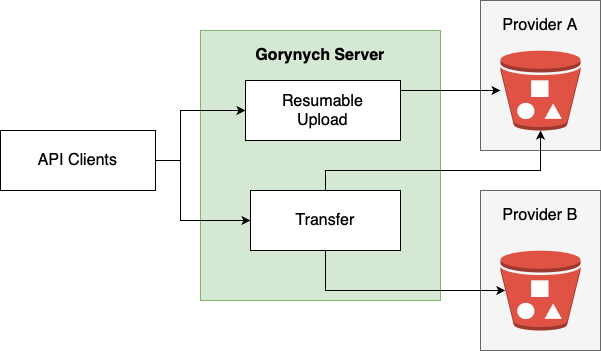

# Gorynych

Multicloud Data Controller for S3 \
Supported clouds:

* Yandex Cloud

## Architecture



## Environment variables

* **SERVICE_CONFIG_PATH** - path to the local config.yml file

## Ports

**Listen port** - 30000

## Configuration

For configuration see `deployment/config-example.yml` file

## Docker

### Build Docker Image

```bash
docker build -t gorynych .
```

### Docker-compose example

Example you can see in `deployment/docker-compose.yml`
